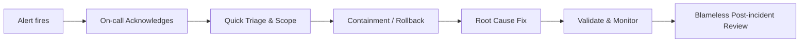
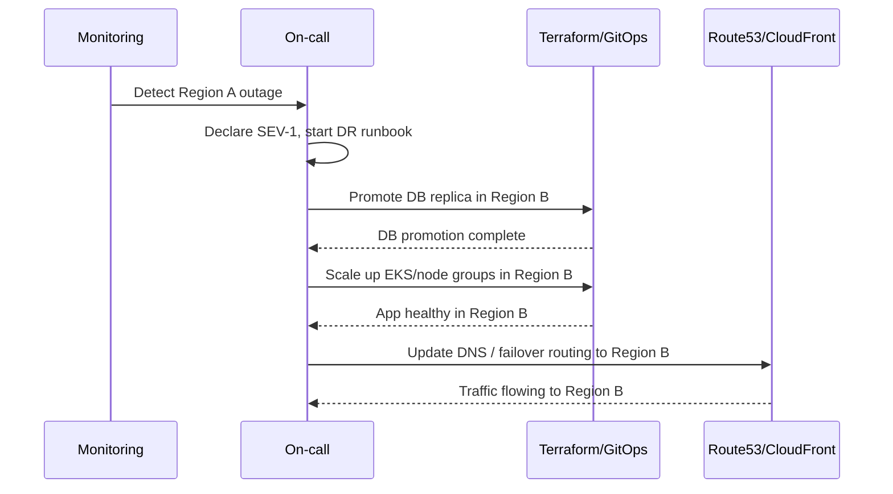

## Cloud Infrastructure Assessment – Multitenant SaaS on AWS EKS

**Candidate:** _[Your Name]_  
**Date:** _[Fill in]_  

### Assumed Business Context

- **Product**: Public-facing, multitenant B2B SaaS platform (API + web UI).
- **Customers**: Mid-size to large enterprises across multiple regions.
- **Criticality**: Business‑critical (direct revenue impact) but not life‑critical.
- **Traffic profile**: Steady baseline with daytime peaks and occasional marketing spikes.

From these assumptions, I define **SLOs, RPOs, and RTOs** that drive the architecture:

- **Availability SLO (core API)**: 99.9% monthly.
- **Latency SLO (core API)**: p95 \< 300 ms, p99 \< 800 ms for read operations under normal load.
- **Error SLO**: 5xx error rate \< 1% of total requests over 5‑minute windows.
- **RPO (core transactional data)**: 5 minutes.  
- **RTO (regional outage)**: 60 minutes to restore service in secondary region.

---

### Section 1: Cloud Architecture & Design (AWS EKS Multitenant SaaS)

#### 1.1 High‑level architecture

**Goals**

- **Security & multitenancy**: Strong tenant isolation at the app and data layers.
- **Scalability**: Horizontal scaling on EKS with autoscaling across 3+ AZs.
- **Reliability**: AZ‑fault tolerance, regional DR, and SLO‑driven design.
- **Operability**: First‑class observability, CI/CD, and GitOps.
- **Cost efficiency**: Right‑sizing and shared infrastructure where safe.

**Logical architecture**

```mermaid
flowchart LR
  U[Users / Tenants] --> CF[CloudFront + WAF]
  CF --> ALB[Public ALB (L7)]
  ALB --> INGRESS[Ingress Controller (EKS)]

  subgraph VPC[Application VPC (3+ AZs)]
    IGW[Internet Gateway]
    NAT[NAT Gateways (per AZ)]

    subgraph PublicSubnets[Public Subnets]
      ALB
      NAT
    end

    subgraph PrivateApp[Private Subnets - App Nodes]
      EKS[EKS Cluster]
      EKS --> SVC[Microservices Pods]
    end

    subgraph PrivateData[Private Subnets - Data]
      RDS[(Aurora/RDS)]
      Redis[(ElastiCache Redis)]
      S3Buckets[(S3 - Encrypted)]
    end
  end

  EKS --> RDS
  EKS --> Redis
  EKS --> S3Buckets

  subgraph Observability[Observability]
    CW[CloudWatch]
    PM[Prometheus]
    GF[Grafana]
    LG[Loki / CloudWatch Logs]
    OTEL[OpenTelemetry Collector]
  end

  EKS --> PM
  EKS --> LG
  EKS --> OTEL --> CW

  subgraph Backup[Backup & DR]
    AWSBackup[(AWS Backup)]
    Velero[(Velero)]
  end

  AWSBackup --> RDS
  AWSBackup --> S3Buckets
  Velero --> EKS
```

#### 1.2 Networking

- **VPC & subnets**
  - **Topology**: One VPC per environment (`dev`, `stg`, `prod`) with **3+ AZs**.
  - **Subnet tiers**:
    - **Public**: ALB, NAT Gateways, optional bastion.
    - **Private (app)**: EKS worker nodes, Fargate profiles (no public IPs).
    - **Private (data)**: RDS/Aurora, ElastiCache, internal data services.
  - **Routing**:
    - Public subnets route to **IGW**.
    - Private subnets route to **NAT Gateways** for outbound internet (e.g., package repos).

- **Network security**
  - **Security Groups (SGs)**:
    - ALB SG: inbound 80/443 from internet; egress to EKS node SG.
    - EKS node SG: inbound from ALB SG / node SG; egress to data tier SGs.
    - DB SG: inbound only from app node SGs and specific admin sources.
  - **Network ACLs (NACLs)**: Coarse subnet‑level allow/deny lists to backstop SGs, e.g., deny known bad CIDR ranges.

- **Ingress & internal traffic**
  - **Ingress**: CloudFront + WAF → ALB → EKS Ingress Controller (NGINX or AWS Load Balancer Controller).
  - **Service exposure**:
    - External APIs via `Ingress` + `LoadBalancer` service.
    - Internal services via `ClusterIP` and optional **service mesh** (App Mesh / Istio) for mTLS and richer routing.

- **Multitenant routing**
  - **Host‑based**: `tenantA.example.com`, `tenantB.example.com` mapped via CloudFront/ALB.
  - **Auth token**: Tenant ID in signed JWT; app enforces tenant scoping on all requests.
  - Premium tenants can have **dedicated namespaces and node groups**, or even **dedicated clusters** if required.

#### 1.3 IAM and security model

- **Identity**
  - **Humans**: AWS IAM Identity Center/SSO backed by IdP (Okta/AD). Roles: SRE, platform engineer, app team, read‑only, break‑glass.
  - **Workloads**: IAM Roles for Service Accounts (**IRSA**) instead of node instance roles.

- **Access patterns**
  - CI/CD uses a tightly scoped IAM role to:
    - Read/write ECR images.
    - Apply manifests via EKS (using IAM + OIDC + RBAC).
  - Application service roles:
    - Read/write to **S3 prefixes** per tenant: `arn:aws:s3:::app-data/tenants/<tenant-id>/*`.
    - Read secrets from **Secrets Manager/SSM** with resource‑level constraints.
    - Access specific RDS clusters and KMS keys only.

- **Secrets management**
  - All app secrets live in **Secrets Manager** or **SSM Parameter Store**.
  - EKS integrates via **Secrets Store CSI driver** or IRSA‑backed init containers.
  - K8s secrets encryption at rest using **KMS‑backed encryption provider**.

- **Tenant isolation**
  - **Application layer**:
    - Tenant ID derived from **JWT** or mTLS client cert.
    - All queries scoped by tenant: schema/row‑level filters and ownership checks.
  - **Data layer** (per tier):
    - Small tenants: shared DB with **tenant_id** column + strict app enforcement.
    - Larger / regulated tenants: **schema‑per‑tenant** or dedicated database.
  - **Compute layer**:
    - Namespaces per domain (`billing`, `auth`, etc.).
    - Optional `tenant-<id>` namespaces for large or regulated tenants.

#### 1.4 Kubernetes & application design

- **EKS cluster layout**
  - **Per environment**: one EKS cluster for `dev`, one for `stg`, one for `prod` (per region).
  - **Node groups**:
    - `system` node group: core add‑ons (CNI, CoreDNS, Ingress, metrics‑server).
    - `general` node group: stateless microservices.
    - Optional: `high-mem`, `gpu`, or `arm` node groups for specialized workloads.
  - **Spot instances** used for stateless workloads with graceful eviction handling.

- **Security hardening**
  - Pod Security Standards (`restricted`) and admission control (OPA/Gatekeeper or Kyverno).
  - Disallow privileged pods, hostPath mounts, and root users where possible.
  - NetworkPolicies:
    - Default **deny‑all** per namespace.
    - Explicit allow between necessary services and the data tier.

- **Scalability**
  - **Horizontal Pod Autoscaler (HPA)**:
    - Metrics: CPU, memory, and custom metrics (QPS, p95 latency).
    - Example: scale from 3 to 50 pods for core API services.
  - **Cluster Autoscaler (CA)**:
    - Scales node groups up/down based on pending pods.
    - Node groups tagged for CA; capacity constrained to prevent runaway scaling.
  - **Vertical Pod Autoscaler (VPA)**:
    - Run in **recommend** mode to inform request/limit tuning.

- **State and storage**
  - Stateful apps (if any) use **EBS gp3** via StorageClasses with encryption, but primary state is off‑cluster (Aurora, S3).
  - S3 for file storage per tenant, with server‑side encryption (SSE‑KMS) and object‑level access policies.

#### 1.5 Monitoring, CI/CD integration, and DR hooks

- **Monitoring integration**
  - Sidecar or daemonset‑based **OpenTelemetry collectors** ship traces/metrics/logs.
  - Prometheus scrapes:
    - Node exporter, kube‑state‑metrics, app endpoints (`/metrics`).
  - Logs:
    - Fluent Bit → CloudWatch Logs or Loki; logs in structured JSON including `tenant_id`, `request_id`, `trace_id`.

- **CI/CD overview**

```mermaid
flowchart LR
  Dev[Developer] --> PR[Git PR]
  PR --> CI[CI Pipeline]
  CI --> Tests[Build + Unit/Integration Tests]
  Tests --> Scan[Security & Lint (SAST, IaC)]
  Scan --> Img[Build & Push Image to ECR]
  Img --> Manifests[Update K8s Manifests/Helm in Git]
  Manifests --> CD[GitOps (Argo CD/Flux)]
  CD --> EKS[EKS Cluster]
```

  - **CI** (e.g., GitHub Actions):
    - Build, unit/integration tests, linting, SAST, image scans.
    - Publish images to **ECR** with immutable tags.
  - **CD** (GitOps preferred):
    - Argo CD watches config repos and syncs versions to EKS.
    - Progressive delivery (blue/green or canary) via Argo Rollouts or service mesh.

- **DR hooks**
  - Terraform describes all infra (VPC, EKS, RDS, etc.) per region.
  - **Velero** backs up Kubernetes resources and persistent volumes to replicated S3.
  - AWS Backup handles RDS and EBS snapshot policies, with cross‑region copies.

#### 1.6 SLOs and trade‑off analysis

- **SLO summary (core API)**

| Dimension       | Target                       | Justification                                      |
|----------------|------------------------------|----------------------------------------------------|
| Availability   | 99.9% monthly                | Business‑critical SaaS, standard for B2B           |
| Latency (p95)  | \< 300 ms                    | Good UX, feasible with caching + regional hosting |
| Latency (p99)  | \< 800 ms                    | Allows occasional GC/slow queries                  |
| Error rate     | \< 1% 5xx over 5 min window  | Protects user experience and revenue              |

- **RPO/RTO by data type**

| Data type                    | RPO         | RTO      | Notes                                      |
|-----------------------------|------------|----------|--------------------------------------------|
| Core transactional (DB)     | 5 minutes  | 60 mins  | Aurora + binlog replication + DR region    |
| Object/file data (S3)       | 15 minutes | 60 mins  | Cross‑region S3 replication                |
| Logs & telemetry            | 60 minutes | N/A      | Loss acceptable (used for debugging)       |
| Configuration (Git, IaC)    | 0          | 60 mins  | Git + Terraform/GitOps                     |

- **Key trade‑offs**
  - **DB sharing vs isolation**:
    - Shared DB cheaper and easier to operate but increases blast radius if a schema issue occurs.
    - Schema‑per‑tenant provides stronger isolation at higher operational cost.
  - **Single vs multiple prod clusters**:
    - Single cluster: simpler ops, better bin‑packing; acceptable with strong namespaces/RBAC.
    - Multiple clusters: used selectively for very large/regulated tenants.
  - **Service mesh adoption**:
    - Provides mTLS, retries, and advanced routing but adds complexity.
    - Start without mesh; introduce when scale and security requirements justify it.

---

### Section 2: Kubernetes Deep Dive & Troubleshooting

Scenario: **Production incident** with latency spikes, `CrashLoopBackOff` pods, `NotReady` nodes, and increased 5xx error rates.

#### 2.1 Step‑by‑step triage process

1. **Confirm impact and scope**
   - Check SLO dashboards:
     - p95/p99 latency vs SLO thresholds.
     - 5xx error rate vs SLO thresholds.
   - Verify if issue is:
     - Global vs single region.
     - All tenants vs subset.

2. **Check cluster health**

```bash
# Node & pod health
kubectl get nodes -o wide
kubectl get pods -A -o wide

# Quickly inspect prod namespace and recent events
kubectl get pods -n prod -o wide
kubectl get events -A --sort-by=.lastTimestamp | tail -n 50
```

3. **Correlate with recent changes**
   - Look at recent deployments (Argo CD history, `kubectl rollout history`).
   - Check infra changes: Terraform applies, node group changes, RDS scaling.

#### 2.2 Investigating `NotReady` nodes

- **Commands**

```bash
kubectl describe node <node-name>
kubectl get nodes -o jsonpath='{range .items[*]}{.metadata.name}{"\t"}{.status.conditions[?(@.type=="Ready")].status}{"\n"}{end}'
```

- **Hypotheses**
  - CNI problems (e.g., AWS VPC CNI IP address exhaustion).
  - Disk pressure from excessive logs or tmp data.
  - Kubelet/container runtime issues.
  - Underlying EC2 issues (network impairment, EBS problems).

- **Immediate mitigation**

```bash
kubectl cordon <node>
kubectl drain <node> --ignore-daemonsets --delete-emptydir-data
```

- Then:
  - Inspect EC2 console for hardware/network issues.
  - If a specific node group or AZ is problematic, **scale that node group down** and replace it with a fresh group in other AZs.

#### 2.3 Investigating `CrashLoopBackOff` pods

- **Commands**

```bash
kubectl get pods -n prod | grep CrashLoopBackOff
kubectl describe pod <pod> -n prod
kubectl logs <pod> -n prod --previous=true
```

- **Hypotheses**
  - Application bug or misconfiguration rolled out in latest deployment.
  - OOMKills due to undersized memory limits.
  - Dependencies unavailable (DB, cache, external APIs).
  - Failing init containers (e.g., migrations, warm‑ups).

- **Immediate mitigations**

```bash
kubectl rollout history deploy <svc> -n prod
kubectl rollout undo deploy <svc> -n prod --to-revision=<n>
```

  - Temporarily increase resources if you clearly see OOMs:

```bash
kubectl edit deploy <svc> -n prod  # increase requests/limits
```

  - If dependency‑related, route around failing functionality via feature flags or throttle traffic.

#### 2.4 Latency spikes and error rates

- **Checks**

```bash
kubectl get deploy -n prod
kubectl describe deploy <svc> -n prod | egrep -A3 "Readiness|Liveness"

kubectl get hpa -n prod
kubectl get pods -n prod -o wide --field-selector status.phase!=Running
kubectl describe hpa <svc> -n prod
```

- **Hypotheses**
  - Traffic spike not matched by scaling (HPA thresholds too high).
  - Retry storms from clients causing thundering herd.
  - Downstream DB contention or hot rows.

- **Mitigations**
  - Temporarily **increase replicas** and **lower HPA thresholds** while investigating root cause.
  - Implement or tighten rate limiting at API gateway/Ingress.
  - Add or tune caching (Redis) on hot read paths.

#### 2.5 Example root cause chain

Example composite scenario:

1. New deployment increases DB connection pool per pod.
2. HPA scales out due to load → DB hits max connections.
3. DB latency increases; apps time out → `CrashLoopBackOff` on startup due to failed health checks.
4. Pods restart frequently, generating log storms → ephemeral disk fills → nodes hit `DiskPressure` → `NotReady`.

**Long‑term fixes**

- Cap per‑pod connection pools and align with DB capacity.
- Introduce circuit breakers and exponential backoff retries.
- Implement log sampling/rate limiting and centralize logs off‑node quickly.
- Increase DB capacity and/or add read replicas and better caching.

#### 2.6 Kubernetes networking failures

- **Symptoms**
  - Inter‑service timeouts (`connection refused`, `i/o timeout`).
  - DNS failures (`no such host` for service names).

- **Commands**

```bash
kubectl get pods -n kube-system -o wide
kubectl logs -n kube-system -l k8s-app=kube-dns

kubectl exec -it <pod> -n prod -- nslookup <service>.<namespace>.svc.cluster.local
kubectl exec -it <pod> -n prod -- curl http://<service>.<namespace>.svc.cluster.local:port/health

kubectl get networkpolicy -A
kubectl describe networkpolicy <np> -n <ns>
```

- **Mitigation**
  - Roll back recent CNI or NetworkPolicy changes.
  - If only a subset of nodes is affected, **cordon/drain** those nodes and recreate the node group.

#### 2.7 Security incident: over‑permissive RBAC and exposed secrets

- **Immediate response**
  - Identify compromised credentials and revoke:
    - Delete service account tokens and rotate IAM keys.
    - Revoke external API keys that were exposed.
  - Lock down RBAC:

```bash
kubectl get clusterrolebinding -A
kubectl describe clusterrolebinding <binding>
```

  - Remove or narrow any `cluster-admin` privileges assigned to service accounts.
  - Trigger secrets rotation for affected systems.

- **Forensics**
  - Review Kubernetes API audit logs and AWS CloudTrail to determine:
    - Which identities accessed which secrets.
    - What operations were performed, and during what time window.

- **Prevention**
  - Enforce **least‑privilege RBAC** and disallow `cluster-admin` for apps.
  - Use policy‑as‑code (OPA/Kyverno) to block dangerous roles and bindings.
  - Implement continuous secret scanning (code, containers, configs).
  - Regular RBAC access reviews and drift detection.

---

### Section 3: Infrastructure as Code & Automation (Terraform)

#### 3.1 Terraform repo structure

```text
infra/
  modules/
    vpc/
    eks/
    rds/
    redis/
    alb/
    observability/
  envs/
    dev/
      main.tf
      backend.tf
      variables.tf
    stg/
      main.tf
      backend.tf
      variables.tf
    prod/
      main.tf
      backend.tf
      variables.tf
```

- **Modules** encapsulate reusable components (VPC, EKS, RDS, etc.).
- `envs/*` wire those modules together with environment‑specific settings and `tfvars`.

#### 3.2 State management

- **Backend**
  - Remote state stored in **S3** with:
    - **DynamoDB** table for state locking.
    - SSE‑KMS encryption and strict bucket policies.
  - Separate state files to reduce blast radius:
    - `network-prod.tfstate`, `eks-prod.tfstate`, `db-prod.tfstate`, etc.

- **Access control**
  - CI/CD role and a small SRE group can apply changes in prod.
  - Read‑only access for others who need visibility.

#### 3.3 Secrets in Terraform

- No secrets committed to Git or plain `.tfvars`.
- Terraform reads from AWS Secrets Manager/SSM through data sources; CI injects values via environment variables or secure secret stores.

#### 3.4 CI/CD pipeline for Terraform

```mermaid
flowchart LR
  Dev[Engineer] --> PR_TF[Terraform PR]
  PR_TF --> CI_TF[CI: fmt/validate/tflint]
  CI_TF --> Plan[terraform plan (env-specific)]
  Plan --> Review[Human Review & Approval]
  Review -->|non-prod| AutoApply[Auto Apply]
  Review -->|prod| ManualApply[Manual Apply / Approved Job]
```

- **On PR**:
  - `terraform fmt`, `terraform validate`, `tflint`.
  - `terraform plan` with remote state; output attached to PR.
- **On merge**:
  - Non‑prod (`dev`, `stg`): apply automatically.
  - Prod: gated by manual approval or protected environment.

#### 3.5 Risky change example and prevention

- **Risky change**

```hcl
desired_capacity = 5
max_size        = 50  # previously 10
```

- Under high load, this allows scaling to 50 nodes:
  - Can overrun DB capacity, NAT/Data transfer cost, and service limits.

- **Prevention**
  - Policy‑as‑code:
    - OPA or Terraform Cloud Policies to disallow `max_size` above env‑specific thresholds.
  - Infracost integrated into CI to highlight large cost deltas.
  - Review checklist for:
    - ASG/node group changes.
    - Wide‑open security groups (`0.0.0.0/0` to sensitive ports).
    - Broad IAM policies (`*:*`).

---

### Section 4: Monitoring, Alerting & Incident Response

#### 4.1 Observability stack

- **Metrics**
  - **Prometheus**: cluster and app metrics via node exporter, kube‑state‑metrics, and app `/metrics`.
  - **CloudWatch**: AWS services (ALB, RDS, EKS, NAT) and custom metrics.
  - **Grafana**: central dashboards combining Prometheus and CloudWatch.

- **Logs**
  - Fluent Bit/Fluentd → CloudWatch Logs or Loki.
  - JSON logs with keys like `tenant_id`, `trace_id`, `user_id`, `route`, `status_code`.

- **Traces**
  - OpenTelemetry SDK in services.
  - Export to AWS X‑Ray or Tempo/Jaeger for request end‑to‑end tracing.

#### 4.2 Alerting philosophy and concrete SLO‑driven alerts

- **Alert only when action is required**:
  - Page on **SLO violations or imminent risk of violation**.
  - Ticket or email for non‑urgent degradations or capacity signals.

- **Sample SLO‑driven alerts**
  - **Availability**:
    - `5xx_rate > 1%` for 5 minutes (per region, per core API).
  - **Latency**:
    - `p95_latency > 300 ms` for 10 minutes; `p99 > 800 ms` flagged but not necessarily paging unless availability also drops.
  - **Resource**:
    - Node CPU > 90% for 10 min.
    - RDS `CPUUtilization > 80%` or connections > 80% of max for 10 min.
    - Disk utilization > 80% on nodes/volumes.
  - **K8s health**:
    - More than N pods in `CrashLoopBackOff` in the `prod` namespace.
    - Any `NotReady` nodes in `prod` sustained beyond a few minutes.

#### 4.3 Incident response workflow (simulated outage)



Example: Core API 5xx > 5% and availability below 99.9% SLO.

1. **Detection & acknowledgment**
   - PagerDuty page for SEV‑1; on‑call acknowledges within 5 minutes.
2. **Triage**
   - Check global dashboards for pattern: region, tenant, endpoint.
   - Check recent deployments (app + infra).
3. **Containment**
   - If a recent deployment correlates, **roll back** rapidly.
   - If regional, shift traffic to healthy region if possible.
4. **Communication**
   - Create incident Slack/Teams channel and assign:
     - Incident commander.
     - Comms lead.
     - Scribe.
   - Update internal stakeholders and, for SEV‑1, **status page**.
5. **Resolution**
   - Deploy or roll back to a stable version; confirm metrics returning to normal SLOs.
6. **Post‑incident review**
   - Within 24–72 hours, run a blameless postmortem capturing:
     - Timeline, root cause, contributing factors.
     - Where detection/alerting worked or failed.
     - Concrete, owned action items with due dates.

---

### Section 5: Cloud Cost Optimization

Incident: **35% month‑over‑month AWS cost increase**.

#### 5.1 Investigation flow

1. **High‑level view**
   - AWS Cost Explorer: Group by **Service**, **Region**, **Tag** (`Environment`, `Team`, `App`, `Tenant`).
2. **Drill down**
   - Identify top contributors by absolute and delta cost:
     - EKS/EC2, RDS, S3, NAT, data transfer.
   - Use CUR and Athena for deeper analysis if needed.
3. **Correlate with usage**
   - Compare utilization (CPU, memory, QPS) with cost increases.
   - Map large cost changes to:
     - Node group changes.
     - RDS class/cluster changes.
     - New tenants/features.

#### 5.2 Immediate controls

- Identify and stop waste:
  - Idle/over‑provisioned nodes and clusters.
  - Old EBS snapshots and unattached volumes.
  - Idle NAT Gateways and ALBs.
- Implement basic **schedules**:
  - Turn off non‑essential dev/stage workloads outside business hours.
- Quick right‑sizing:
  - Reduce HPA minimums and instance sizes for underutilized services.

#### 5.3 Long‑term optimization

- **Governance**
  - Enforce tagging for cost allocation.
  - Team‑level budgets and monthly reviews.
  - Budget alerts at 80%, 100%, and 120% of forecast.

- **Engineering practices**
  - Include **Infracost** in PRs to surface cost impact early.
  - Regular load/performance testing to size infra correctly.

- **Technical levers**
  - Right‑size EKS nodes and pod requests/limits for efficient bin‑packing.
  - Use **Savings Plans**/Reserved Instances for predictable baseline loads.
  - Optimize data transfer:
    - Keep chatty services co‑located.
    - Use private endpoints (e.g., interface VPC endpoints) where appropriate.

---

### Section 6: Disaster Recovery & Business Continuity

#### 6.1 DR strategy and RPO/RTO

- **Targets (aligned with context)**
  - **Core API availability SLO**: 99.9% monthly.
  - **RPO (core DB)**: 5 minutes (Aurora global database or binlog‑based replication).
  - **RTO (full region outage)**: 60 minutes (active‑passive multi‑region).

- **Strategy**
  - Primary region: active with full capacity.
  - Secondary region: warm standby with pre‑provisioned EKS, smaller node groups, and cross‑region DB replica.
  - Infra defined in Terraform; app deployed via GitOps to both regions.

#### 6.2 Backups and replication

- **Database**
  - Automated daily backups with PITR.
  - Cross‑region read replica or Aurora Global Database for fast promotion.

- **Kubernetes resources**
  - Velero backups (namespaces, deployments, services, PVCs) to S3 with replication.
  - Git as the ultimate source of truth for manifests (GitOps).

- **Object storage**
  - S3 buckets with **cross‑region replication** for tenant data.

#### 6.3 Regional failover steps



1. **Detect**: Health checks and synthetic tests show Region A failure.
2. **Decide**: Incident commander triggers failover.
3. **Promote DB**: Promote cross‑region replica in Region B to primary.
4. **Scale app**: Use Terraform/GitOps to ensure EKS and workloads in Region B are scaled to handle full load.
5. **Switch traffic**: Update Route 53 failover records / CloudFront origins to point to Region B.
6. **Validate**: Run smoke tests, then announce restored service.

Failback is deliberate and planned, potentially keeping Region B as new primary.

---

### Section 7: Documentation & Leadership

#### 7.1 Incident runbook outline

**Runbook template: “API Latency and Errors – Prod”**

- **1. Purpose & scope**
  - When to use this runbook and what systems it covers.
- **2. Triggers**
  - Alerts that map to this runbook (e.g., `api_5xx_rate` SLO violations).
- **3. Quick checks**
  - Links to:
    - Grafana dashboards.
    - Log queries in CloudWatch/Loki.
    - Common `kubectl` commands.
- **4. Decision tree**
  - Branches for:
    - `NotReady` nodes.
    - `CrashLoopBackOff` pods.
    - DB saturation.
    - External dependency issues.
- **5. Standard mitigations**
  - Rollbacks, scaling strategies, feature flag toggles.
- **6. Escalation**
  - When to involve DB/SRE/security teams.
- **7. Post‑incident**
  - Ensure tickets and postmortem are created.

#### 7.2 On‑call escalation guide

- **Roles**
  - Primary on‑call (per rotation).
  - Secondary backup on‑call.
  - Incident commander (for SEV‑1).
  - Comms lead (status page, stakeholder updates).

- **Severities and expectations**
  - **SEV‑1**: Global or major outage; 5‑minute ack; 24/7 paging.
  - **SEV‑2**: Partial outage/degradation; 15‑minute ack.
  - **SEV‑3+**: Non‑urgent issues; business‑hours response.

- **Escalation paths**
  - If primary doesn’t acknowledge within N minutes, page secondary.
  - If blocked, involve engineering manager or vendor support.

- **Handovers**
  - Standardized shift‑change updates:
    - Current incidents and status.
    - Outstanding mitigations and follow‑ups.

#### 7.3 Mentoring and communication style

- **Mentoring junior engineers**
  - Pair on incidents where safe, starting with observer role, then driver role in low‑risk scenarios.
  - Encourage them to **own and improve runbooks**, adding clarity and automation.
  - After incidents, run debriefs focusing on decision‑making, not just commands.

- **Communicating incidents**
  - **To executives / business stakeholders**:
    - Plain‑language summaries: impact, timeline, mitigation, and next steps.
    - Example:  
      “From 10:02–10:18 UTC, ~30% of EU API requests failed due to a database configuration change. We rolled back the change and increased capacity; the system has been stable since 10:20. We are adding safeguards so this configuration cannot be changed without additional review.”
  - **To engineering teams**:
    - Detailed technical postmortems: metrics, logs, root causes, and corrective actions.
    - Open feedback loops on where tooling, docs, or processes failed and how to improve them.

---

This Markdown file is structured and formatted for direct submission. It can be exported as PDF from your editor or Markdown tooling without modification.

